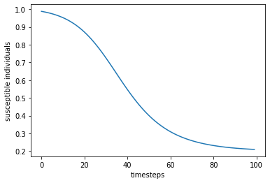
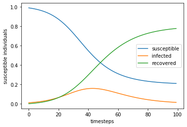
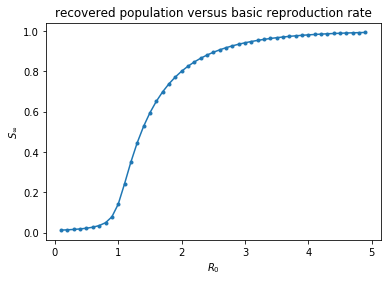
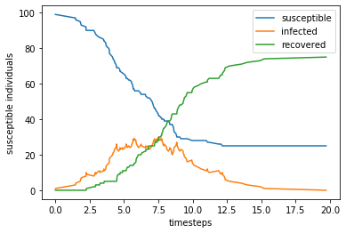
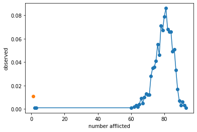
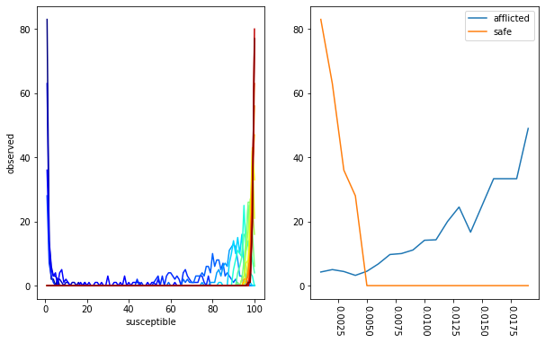
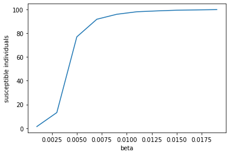
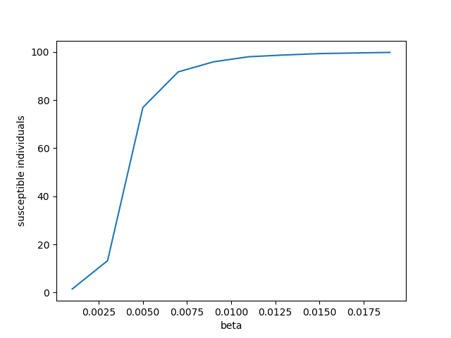

---
layout: post
# title: "epidemic"
title: ""
tags:
    - python
    - notebook
--- 
# A minimal compartmental model for an epidemic

In this exercise we will build a small mathematical model for the spread of an
epidemic and use it to demonstrate a number of techniques, including basic
parallelization. 
 
### Requirements

The following exercise requires a number of skills which are essential for
efficiently performing basic data analysis. I recommend that users install an
Anaconda environment with the following dependencies:

```
dependencies:
  - python=3.7
  - matplotlib
  - scipy
  - numpy
  - nb_conda_kernels
  - au-eoed::gnu-parallel
  - pip
```

There are instructions for building environments [available here](https://marcc-
hpc.github.io/tutorials/shortcourse_python.html). Users are free to try the
tutorial on *Blue Crab* or on their local machines, however subsequent exercises
will use SLURM for parallelization.

To build an environment with the dependencies above, add them to a text file
called `reqs.yaml` and run:

```
conda create -p ./my_env --file reqs.yaml
```

followed by `conda activate ./my_env`. You are free to choose a different name.

#### Lesson objectives

1. Solve a simple ordinary differential equation (ODE) for a minimal epidemic
model
2. Perform a parameter sweep to understand the model better
3. Create a stochastic simulation for the model
4. Visualize and save the results

#### Code objectives

1. Understand Python imports
2. Conceptualize builtin data types
3. Use basic `numpy` data types
4. Write functions using arguments and keyword arguments
5. Use generators such as `enumerate` to build loops
6. Understand array "slicing" in `numpy`
7. Make histograms 
 
## 1. The model 
 
The susceptible-infected-recovered (SIR) model can be used to describe the
spread of disease in a population.

$$
\begin{aligned}
\frac{dS}{dt} &= \mu N - \mu S - \beta \frac{S I}{N} \\
\frac{dI}{dt} &= \beta \frac{S I}{N} - \gamma I - \mu I \\
\frac{dR}{dt} &= \gamma I - \mu R \\
N &= S + I + R
\end{aligned}
$$

In this model, $S,I,R$ represent the proportion of susceptible, infected, and
recovered components of a population. The $\mu$ parameter is the population
growth rate for a mean lifetime of $\frac{1}{\mu}$. The transmission or contact
rate is $\beta$ and represents the number of disease-transmitting contacts per
unit time per infected host. The recovery parameter $\gamma$ is the number of
recoveries per unit time, giving an expected duration of the disease of
$\frac{1}{\gamma}$ which implicitly assumes a waiting time of $e^{-\gamma t}$.

The model therefore includes a biological and behavioral component. The model
assumes a "well-mixed" population. The model is due to Kermack and McKendrick
(1927). The following exercise is adapted from [a course by Chris Meyers](http:/
/pages.physics.cornell.edu/~myers/teaching/ComputationalMethods/ComputerExercise
s/SIR/SIR.html). 

**In [1]:**


# import required libraries
import sys
import numpy as np
import scipy
import scipy.integrate


**In [2]:**


# imports for plotting
import matplotlib as mpl
%matplotlib inline
import matplotlib.pyplot as plt


**In [3]:**


# numpy basics:
a = [1,2,3]
a * 10
b = np.array([1,2,3])
b * 10
# what about `a * 10`?



    array([10, 20, 30])


**In [4]:**


# initial settings
N = 100
I = 1
S = N - I
R = 0
beta = 0.2
gamma = 1./10


**In [5]:**


# a single timestep
y0 = np.array([S, I, R], dtype=float)/N

 
Assume constant population hence $\mu=0$. And compute a single timestep. 

**In [6]:**


# choose a starting point
y = y0
# define the differential equations
s,i,r = y
dsdt = -beta * s * i
didt = beta * s * i - gamma *i
drdt = gamma * i
update = np.array([dsdt, didt, drdt])
y += update
print('update: %s'%update)
print('state: %s'%y)


    update: [-0.00198  0.00098  0.001  ]
    state: [0.98802 0.01098 0.001  ]

 
Now we turn the ODEs into a function. 

**In [7]:**


def dydt(y,t,beta,gamma):
    s,i,r = y
    dsdt = -beta * s * i
    didt = beta * s * i - gamma *i
    drdt = gamma * i
    update = np.array([dsdt, didt, drdt])
    return update


**In [8]:**


dydt(y0,0,beta=beta,gamma=gamma)



    array([-0.00216969,  0.00107169,  0.001098  ])


**In [9]:**


times = np.arange(100)


**In [10]:**


answer = scipy.integrate.odeint(dydt, y0, times, args=(beta, gamma))
# answer


**In [11]:**


# a quick primer on arguments and keyword arguments
def function(a,*b):
    print('argument a: %s'%str(a))
    print('argument(s) *b: %s'%str(b))
function(1,2,3,4)


    argument a: 1
    argument(s) *b: (2, 3, 4)


**In [12]:**


# make a plot
fig = plt.figure()
ax = fig.add_subplot(111)
ax.plot(times,answer[:,0],'-',label='susceptible')
ax.set_xlabel('timesteps')
ax.set_ylabel('susceptible individuals')
plt.show()


 
 


**In [13]:**


list(enumerate('abc'))



    [(0, 'a'), (1, 'b'), (2, 'c')]


**In [14]:**


def review(times,*series,fn=None):
    """Summarize the results."""
    fig = plt.figure()
    ax = fig.add_subplot(111)
    names=('susceptible','infected','recovered')
    for ii,i in enumerate(series):
        ax.plot(times,i,'-',label=names[ii])
    ax.legend()
    ax.set_xlabel('timesteps')
    ax.set_ylabel('susceptible individuals')
    if fn:
        plt.savefig('trajectory.png')
    plt.show()


**In [15]:**


review(times,*answer.T)


 
 

 
An alternate parameter to describe our model is the *basic reproduction number*,
$R_0 = \frac{\beta}{\gamma}$ which represents the transmission rate over the
mean duration of the disease. If this parameter dips below 1, then we might
expect the disease to die out on average. 

**In [16]:**


# choose a sufficiently long time
times = np.arange(1000)
r0_vals = np.arange(0.1,5,0.1)
sweep = np.zeros((len(r0_vals),2))
gamma = 10.0
for row,r0 in enumerate(r0_vals):
    beta = r0*gamma
    answer = scipy.integrate.odeint(dydt, y0, times, args=(beta, gamma))
    sweep[row] = (r0,answer[-1][-1])


**In [17]:**


plt.plot(sweep.T[0],sweep.T[1],'.-')
plt.xlabel('$R_0$')
plt.ylabel(r'$S_\infty$')
plt.title('recovered population versus basic reproduction rate')
plt.show()


 
 

 
## 2. A Stochastic Model for the Epidemic 

**In [18]:**


# initial settings
N = 100
I = 1
S = N - I
R = 0
beta = 0.2
gamma = 1./10


**In [19]:**


class StochasticSIR:

    def __init__(self,beta,gamma,S,I,R):
        self.S = S
        self.I = I
        self.R = R
        self.beta = beta
        self.gamma = gamma
        self.t = 0.
        self.N = S + I + R
        self.trajectory = np.array([[self.S, self.I, self.R]])
        self.times = None

    def step(self):
        transition = None
        # define rates
        didt = self.beta * self.S * self.I
        drdt = self.gamma * self.I
        total_rate = didt + drdt
        if total_rate == 0.:
            return transition, self.t
        # get a random number
        rand = np.random.random()
        # rates determine the event
        if rand < didt/drdt:
            self.S -= 1
            self.I += 1
            transition = 1
        else:
            self.I -= 1
            self.R += 1
            transition = 2
        # the event happens in the future
        dt = np.random.exponential(1./total_rate,1)[0]
        self.t += dt
        return transition, self.t

    def run(self, T=None, make_traj=True):
        """The Gillespie algorithm."""
        if T is None:
            T = sys.maxsize
        self.times = [0.]
        t0 = self.t
        transition = 1
        while self.t < t0 + T:
            transition, t = self.step()
            if not transition:
                return self.t
            if make_traj: self.trajectory = np.concatenate(
                (self.trajectory, [[self.S,self.I,self.R]]), axis=0)
            self.times.append(self.t)
        return self.tB


**In [20]:**


model = StochasticSIR(0.005,1./2,100-1,1,0)
model.run()
review(model.times,*model.trajectory.T)
print(model.trajectory[-1])


 
 


    [25  0 75]


**In [21]:**


# run many experiments
beta = 0.005
gamma = 1./2
N = 100
I = 1
S = N-I
n_expts = 1000
result = np.zeros((n_expts,))
for expt_num in range(len(result)):
    model = StochasticSIR(beta=beta,gamma=gamma,S=S,I=I,R=R)
    model.run()
    result[expt_num] = model.trajectory[-1][2]


**In [22]:**


# summarize the experiments
counts,edges = np.histogram(result,bins=0.5+np.arange(0,N+1))
mids = (edges[1:]+edges[:-1])/2.
valid = np.all((counts>0,mids>1),axis=0)
plt.plot(mids[valid],counts[valid]/n_expts,'o-')
plt.plot(mids[0],counts[0]/n_expts,'o')
plt.xlabel('number afflicted')
plt.ylabel('observed')
plt.show()


 
 

 
Compute the mean susceptibility for infections that spread beyond one person. 

**In [23]:**


# explain a single result in words
print('The average recovered number of hosts if the infection spread is: %.2f'%result[result>1].mean())
print(r'In %.1f%% of cases the infection did not spread'%result[result<=1].mean())


    The average recovered number of hosts if the infection spread is: 79.31
    In 1.0% of cases the infection did not spread

 
### Study the transmission rate 

**In [75]:**


# roll the models above into a single function
def study_beta(
    beta = .005,
    gamma = 1./2,
    N = 100,
    I = 1,
    n_expts = 1000):
    """Run many experiments for a particular beta 
    to see how many infections spread."""
    S = N-I
    result = np.zeros((n_expts,))
    for expt_num in range(len(result)):
        model = StochasticSIR(beta=beta,gamma=gamma,S=S,I=I,R=R)
        model.run()
        result[expt_num] = model.trajectory[-1][2]
    return result

n_expts = 100
beta_sweep = np.arange(0.001,0.02,0.001)

results = np.zeros((len(beta_sweep),n_expts))
for snum,beta in enumerate(beta_sweep):
    print('%d '%snum,end='')
    results[snum] = study_beta(beta=beta,n_expts=n_expts)


    0 1 2 3 4 5 6 7 8 9 10 11 12 13 14 15 16 17 18 

**In [25]:**


beta_sweep



    array([0.001, 0.002, 0.003, 0.004, 0.005, 0.006, 0.007, 0.008, 0.009,
           0.01 , 0.011, 0.012, 0.013, 0.014, 0.015, 0.016, 0.017, 0.018,
           0.019])


**In [26]:**


# reformulate the results
summary_stats = []
for enum,beta in enumerate(beta_sweep):
    result = results[enum]
    counts,edges = np.histogram(result,bins=0.5+np.arange(0,N+1))
    mids = (edges[1:]+edges[:-1])/2.
    valid = np.all((mids>1,counts>1),axis=0)
    row = (beta,counts[valid].mean(),counts[0])
    summary_stats.append(row)
# our first list comprehension!
beta_vs_spread = np.array([(beta,spread) for beta,spread,safe in summary_stats])
beta_vs_safe = np.array([(beta,safe) for beta,spread,safe in summary_stats])


**In [27]:**


fig = plt.figure(figsize=(10,6))
ax = plt.subplot(121)
color_vals = np.linspace(0,1,len(results))
for rnum,result in enumerate(results):
    counts,edges = np.histogram(result,bins=0.5+np.arange(0,N+1))
    mids = (edges[1:]+edges[:-1])/2.
    ax.plot(mids,counts,'-',color=mpl.cm.jet(color_vals[rnum]))
    ax.set_xlabel('susceptible')
    ax.set_ylabel('observed')
ax = plt.subplot(122)
ax.plot(*beta_vs_spread.T,label='afflicted')
ax.plot(*beta_vs_safe.T,label='safe')
plt.tick_params(axis='x', labelrotation=-90) 
ax.legend()
plt.show()


 
 

 
**Next time:** We will use the example code above to run an embarassingly
parallel (or "pleasingly parallel") set of simulations. 
 
## 3. Package the Code

In order to perform a more extensive set of experiments, we will package the
code from the example above by putting it into a single script. We can then run
this script in parallel using SLURM or GNU parallel. 

**In [168]:**


%%file epidemic_expt.py

# import required libraries
import sys
import numpy as np
import scipy
import scipy.integrate

class StochasticSIR:

    def __init__(self,beta,gamma,S,I,R):
        self.S = S
        self.I = I
        self.R = R
        self.beta = beta
        self.gamma = gamma
        self.t = 0.
        self.N = S + I + R
        self.trajectory = np.array([[self.S, self.I, self.R]])
        self.times = None

    def step(self):
        transition = None
        # define rates
        didt = self.beta * self.S * self.I
        drdt = self.gamma * self.I
        total_rate = didt + drdt
        if total_rate == 0.:
            return transition, self.t
        # get a random number
        rand = np.random.random()
        # rates determine the event
        if rand < didt/drdt:
            self.S -= 1
            self.I += 1
            transition = 1
        else:
            self.I -= 1
            self.R += 1
            transition = 2
        # the event happens in the future
        dt = np.random.exponential(1./total_rate,1)[0]
        self.t += dt
        return transition, self.t

    def run(self, T=None, make_traj=True):
        """The Gillespie algorithm."""
        if T is None:
            T = sys.maxsize
        self.times = [0.]
        t0 = self.t
        transition = 1
        while self.t < t0 + T:
            transition, t = self.step()
            if not transition:
                return self.t
            if make_traj: self.trajectory = np.concatenate(
                (self.trajectory, [[self.S,self.I,self.R]]), axis=0)
            self.times.append(self.t)
        return self.tB
    
# roll the models above into a single function
def study_beta(
    beta = .005,
    gamma = 1./2,
    N = 100,
    I = 1,
    n_expts = 1000):
    """Run many experiments for a particular beta 
    to see how many infections spread."""
    S = N-I
    result = np.zeros((n_expts,))
    for expt_num in range(len(result)):
        model = StochasticSIR(beta=beta,gamma=gamma,S=S,I=I,R=R)
        model.run()
        result[expt_num] = model.trajectory[-1][2]
    return result

if __name__=='__main__':
    print(' '.join(sys.argv))
    # testing mode
    mode = 'test' if len(sys.argv)==2 else 'sweep'
    
    # ensure that we have an argument for the seed
    if len(sys.argv)<2:
        raise Exception('you must supply a seed')
    else: seed_val = int(sys.argv[1])

    # initial settings
    N = 1000
    I = 1
    S = N - I
    R = 0
    beta = 0.2
    gamma = 1./10
    
    # parameter sweep settings, ten total
    sweep_global = np.arange(0.001,0.02+0.001,0.002) 
    
    np.random.seed(seed_val)
    n_expts = 100
    if mode=='sweep':
        # if we send a second index it marks the beta parameter in the sweep
        index = int(sys.argv[2])
        beta = sweep_global[index]
    elif mode=='test':
        beta = 0.002
    result = study_beta(beta=beta,n_expts=n_expts)
    if mode=='test':
        print('result: %s'%str(result))
        print('average: %s'%str(result.mean()))
    elif mode=='sweep':
        # write the results to a file
        with open('result_%d.txt'%index,'w') as fp:
            fp.write("n_expts %d\nN %d\nI %d\nS %d\nbeta %.4f\ngamma %.4f\nresult %s\n"%(
                n_expts,N,I,S,beta,gamma,result))
            fp.write('average %s\n'%str(result.mean()))


    Overwriting epidemic_expt.py

 
In the code above, I have forced the user to include an argument for the
numerical "seed" for our random number generator. Use the magic BASH operator
(`1`) to try this experiment a few times to see what the results are. 

**In [169]:**


# run a single experiment
! time python epidemic_expt.py 1


    epidemic_expt.py 1
    result: [ 1. 20.  1.  1.  2.  2.  1.  6.  4.  1.  1.  1.  1. 16.  2. 12.  1.  2.
      1.  1.  2.  1.  4.  1.  1.  3. 12.  1.  2.  1.  2.  1.  1.  4.  5.  5.
      4.  1.  1.  1.  1.  1.  1.  1.  3.  4.  1.  1.  1.  4.  1.  2.  3.  1.
      2.  1.  1.  1.  1.  2.  1.  1.  1.  2.  2.  3.  2.  1.  1.  1.  1.  1.
      2.  1.  1.  1. 15.  3.  1.  1.  1.  3.  1.  1.  2.  1.  2.  5.  4.  1.
      1.  1.  1.  1.  1.  1.  1.  1.  1.  4.]
    average: 2.39
    
    real	0m0.257s
    user	0m0.438s
    sys	0m0.089s

 
## 3. Basic parallelism

Next we will use [GNU parallel](https://www.gnu.org/software/parallel/) to
parallelize this calculation. We will discuss the following syntax in class,
however you are welcome to read the manual (via `! parallel --help`). Try to use
different numbers of processors with the `-j` flag to see how it affects the
speed. 

**In [170]:**


# perform the parameter sweep with GNU parallel
! time parallel -j 4 "python epidemic_expt.py" 1 ::: {0..9}


    epidemic_expt.py 1 0
    epidemic_expt.py 1 1
    epidemic_expt.py 1 2
    epidemic_expt.py 1 3
    epidemic_expt.py 1 4
    epidemic_expt.py 1 5
    epidemic_expt.py 1 6
    epidemic_expt.py 1 7
    epidemic_expt.py 1 8
    epidemic_expt.py 1 9
    
    real	0m1.716s
    user	0m5.719s
    sys	0m1.526s


**In [171]:**


# check for the results files
! ls


    base.tpl         makefile         result_3.txt     result_7.txt
    config.py        result_0.txt     result_4.txt     result_8.txt
    epidemic.ipynb   result_1.txt     result_5.txt     result_9.txt
    epidemic_expt.py result_2.txt     result_6.txt


**In [172]:**


# view the results
# ! cat result_*

 
Collect the results by reading the numbers from the last line of each results
file. 

**In [173]:**


import glob
fns = glob.glob('result_*')


**In [174]:**


# collect all of the data
collected = {}
for fn in fns:
    with open(fn) as fp:
        text = fp.read()
    lines = text.splitlines()
    # join and split the data
    lines_reduced = dict([(i.split()[0],' '.join(i.split()[1:])) for i in lines])
    # index the data by beta
    collected[lines_reduced['beta']] = lines_reduced


**In [186]:**


# reformulate the results
ts = [(float(j['beta']),float(j['average'])) for i,j in collected.items()]
ts = sorted(ts,key=lambda x:x[0])


**In [188]:**


# make a plot
fig = plt.figure()
ax = fig.add_subplot(111)
ax.plot(*zip(*ts),'-',label='susceptible')
ax.set_xlabel('beta')
ax.set_ylabel('susceptible individuals')
plt.show()


 
 

 
Now that we have run the calculation in parallel, we can write a script to do
the post-processing. 

**In [198]:**


%%file epidemic_expt_post.py

# imports for plotting
import matplotlib as mpl
# turn off the backend
mpl.use('Agg')
import matplotlib.pyplot as plt

import glob
fns = glob.glob('result_*')

# collect all of the data
collected = {}
for fn in fns:
    with open(fn) as fp:
        text = fp.read()
    lines = text.splitlines()
    # join and split the data
    lines_reduced = dict([(i.split()[0],' '.join(i.split()[1:])) for i in lines])
    # index the data by beta
    collected[lines_reduced['beta']] = lines_reduced

# reformulate the results
ts = [(float(j['beta']),float(j['average'])) for i,j in collected.items()]
ts = sorted(ts,key=lambda x:x[0])

# make a plot
fig = plt.figure()
ax = fig.add_subplot(111)
ax.plot(*zip(*ts),'-',label='susceptible')
ax.set_xlabel('beta')
ax.set_ylabel('susceptible individuals')
plt.savefig('beta_susceptible.png')
plt.close()


    Overwriting epidemic_expt_post.py


**In [199]:**


! python epidemic_expt_post.py


**In [200]:**


! ls


    base.tpl              job.sh                result_4.txt
    beta_susceptible.png  makefile              result_5.txt
    config.py             result_0.txt          result_6.txt
    epidemic.ipynb        result_1.txt          result_7.txt
    epidemic_expt.py      result_2.txt          result_8.txt
    epidemic_expt_post.py result_3.txt          result_9.txt


**In [201]:**


# check on the image inside the notebook
from IPython.display import Image
Image(filename='beta_susceptible.png') 



 
 


 
## 4. SLURM Job Arrays

In this section we will use a SLURM job array. The job array should only be used
when your calculation takes longer than a few minutes, since there is a small
(time) penalty for starting each new job. Using GNU parallel works much like a
standard `for` loop and does not have such a penalty, however it requires that
you allocation all of the hardware at once. Submitting a job array to SLURM will
allow jobs to run whenever the hardware for a single job is available. 

**In [203]:**


%%file epidemic_job.sh
#!/bin/bash

#SBATCH -p express
#SBATCH -c 1
#SBATCH -t 10
#SBATCH --array=0-9

module load anaconda
conda env list
conda activate plotly
export SEED=1
python epidemic_expt.py $SEED $SLURM_ARRAY_TASK_ID


    Writing epidemic_job.sh

 
The workflow on MARCC might look something like this:

```
ssh marcc
# choose a location for this experiment
cd carefully/choose/a/path/please
# clone the repository
git clone http://github.com/marcc-hpc/tutorial-repo
# go into the notebooks folder
cd tutorial-repo/notebooks
# load an environment with some of the programs we need
# note that you can make your own too and update it with:
# with: conda env update --file reqs.yaml -p ./path/to/env
ml anaconda
conda env list
# use a public environment or activate your own
conda activate plotly
# if your envionment lacks GNU parallel, load the module for it
ml parallel
# use the prepared script to run a parameter sweep
parallel -j 4 python epidemic_expt.py 1 ::: {0..9}
# post-processing generates the plot
python epidemic_expt_post.py
# clean up the files for the next test
rm result_*
# inspect the job file first
cat epidemic_job.sh
# submit the file
sbatch job.sh
# reload the environment to do the post-processing
ml anaconda
conda activate plotly
# make the plot
python epidemic_expt_post.py
``` 
